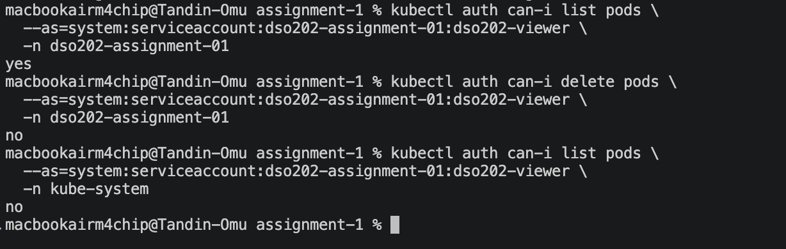
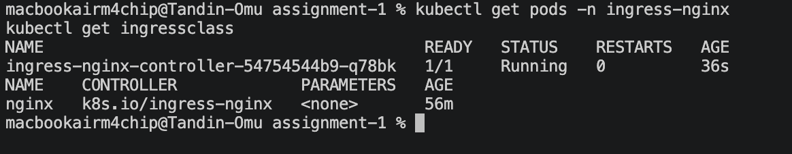
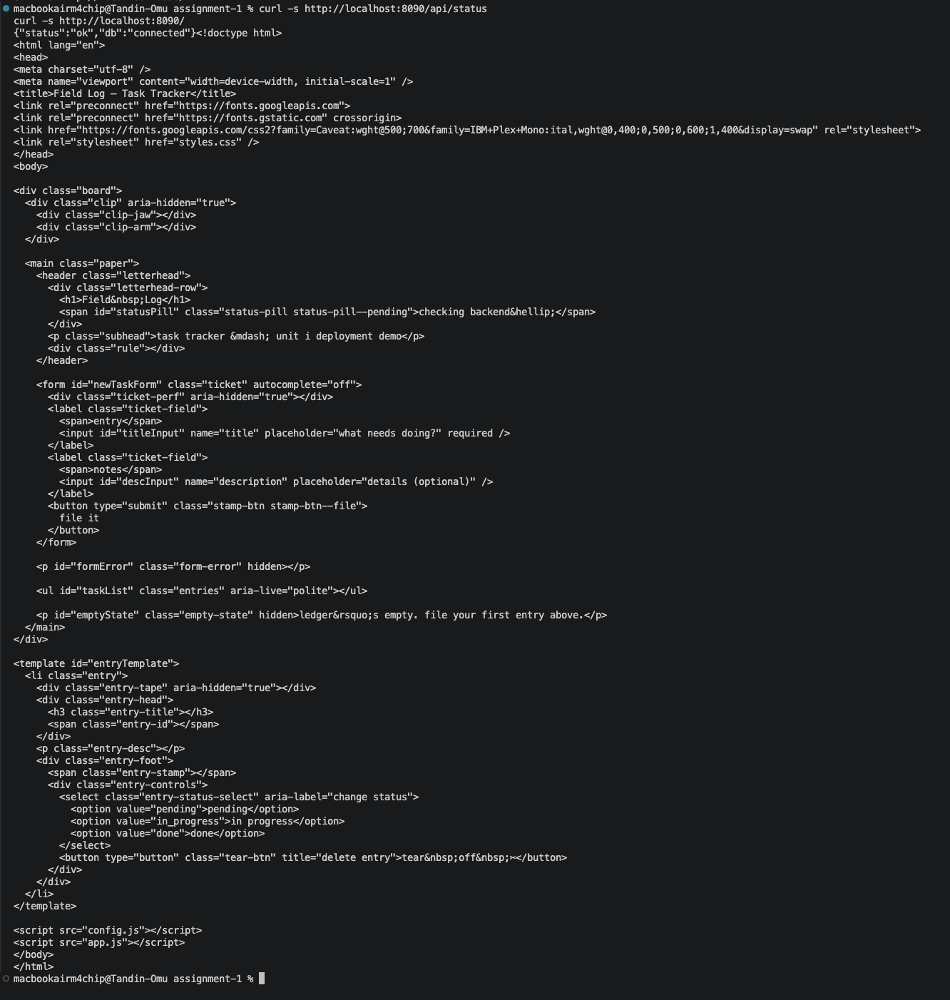
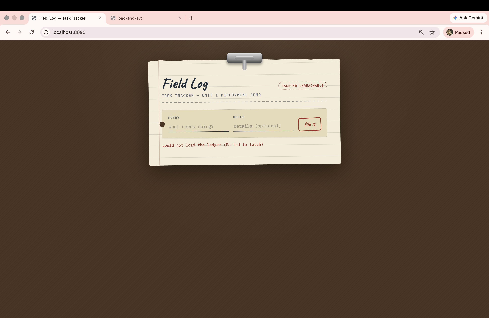
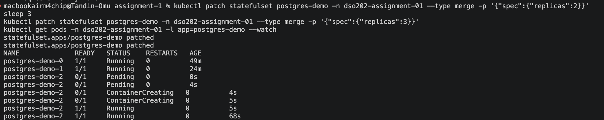
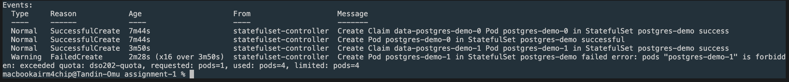
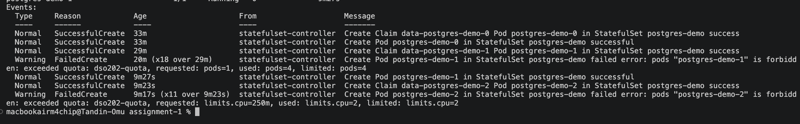
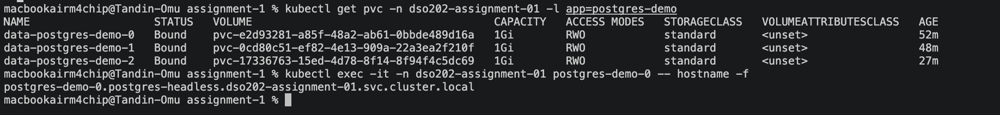
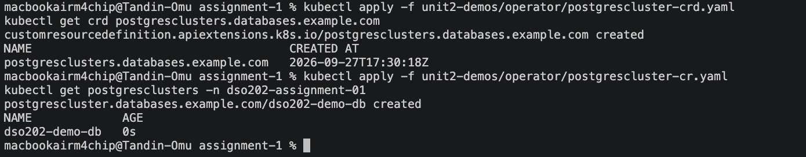
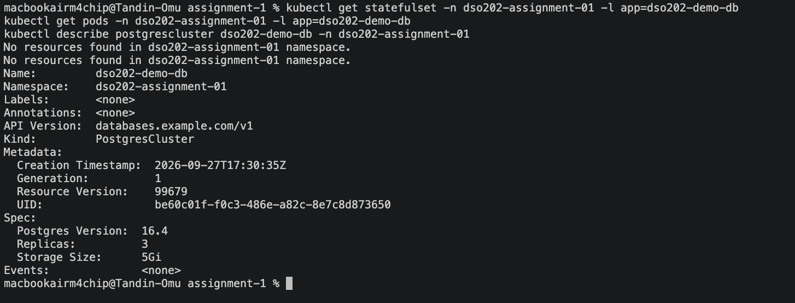

# DSO202 Assignment 2: Unit II Concepts Applied to the Task Tracker Deployment

## Introduction

Unit II covers four advanced Kubernetes topics: StatefulSets, Ingress, RBAC, and Operators.

This assignment applies these concepts to the Task Tracker deployment from Assignment 1. RBAC and Ingress were added to the existing application. StatefulSets and Operators were demonstrated separately in the same namespace because they were not suitable replacements for the existing deployment.

## Task A: RBAC

A ServiceAccount, Role, and RoleBinding were created to give read-only access to the `dso202-assignment-01` namespace.

**ServiceAccount:** `dso202-viewer`

**Role:** `dso202-pod-and-service-reader`

The Role allows `get`, `list`, and `watch` for pods, services, configmaps, and deployments. It does not allow creating, updating, or deleting resources.

The RoleBinding connects the ServiceAccount and Role and limits the access to this namespace.

The permissions were tested as follows:

| Check | Result |
|---|---|
| List pods in the namespace | Allowed |
| Delete pods in the namespace | Blocked |
| List pods in `kube-system` | Blocked |



The test with `kube-system` shows that the access is limited to the `dso202-assignment-01` namespace and does not apply to the whole cluster.

## Task B: Ingress

The NGINX Ingress Controller was installed to provide one entry point for the frontend and backend.

| Path | Goes to |
|---|---|
| `/api` | Backend |
| `/` | Frontend |



Both routes were tested using curl and returned the expected responses.



### Ingress Routing Problem

The first Ingress configuration used the `rewrite-target: /` annotation from a lecture example. This caused every request path to be changed to `/`.

For example, `/api/status` was sent to the backend as `/`, which caused the backend to return `Cannot GET /`.

Removing the annotation fixed the problem because this application needs the original path to be passed to the backend.

### Frontend Browser Issue

The frontend can be opened through the Ingress, but it still shows `backend unreachable`.

The frontend JavaScript uses `backend-svc`, which is a cluster-internal address. A browser outside the cluster cannot resolve this address.

A relative backend path was tested as a possible solution. However, the container startup script has a hardcoded fallback that replaces an empty value with its default value.

Fixing this properly would require rebuilding the provided image. This was outside the assignment scope because the provided images must be used.

The curl tests confirm that the Ingress routing itself works correctly.



## Task C: StatefulSets

The main database remains a single-replica Deployment because a StatefulSet is mainly useful when multiple replicas need their own stable identity and storage.

To demonstrate StatefulSets, a separate three-replica PostgreSQL StatefulSet was deployed in the same namespace.

The pods started one at a time and in order.



### ResourceQuota Problem

The ResourceQuota from Assignment 1 affected the StatefulSet because the quota applies to the whole namespace.

The first limit reached was the pod limit.



After increasing the pod limit, the CPU limit was reached.



The quota was temporarily increased to complete the demonstration and was then returned to its original values.

### Stable Storage and Network Identity

Each StatefulSet replica received its own storage and stable network identity.

```text
data-postgres-demo-0   Bound   1Gi
data-postgres-demo-1   Bound   1Gi
data-postgres-demo-2   Bound   1Gi

postgres-demo-0.postgres-headless.dso202-assignment-01.svc.cluster.local
```



The StatefulSet was then scaled down to zero. The pods stopped in reverse order, starting with pod 2, followed by pod 1 and pod 0.

## Task D: Operators

An actual Operator controller was not part of the topics covered. Therefore, a Custom Resource Definition was installed and one Custom Resource was created to demonstrate how CRDs work.

A `PostgresCluster` CRD was installed and a Custom Resource named `dso202-demo-db` was created.



Since there was no Operator controller running, nothing happened after creating the Custom Resource. There were no pods, StatefulSets, status changes, or events.



The API server accepted and stored the Custom Resource, which confirms that the CRD was working. However, a CRD alone does not create or manage an application. An Operator is required to watch the Custom Resource and perform those actions.

## Problems Faced

- The Ingress annotation from a lecture example caused incorrect API routing. Removing the annotation fixed the issue.
- The Ingress controller images were slow to pull inside the kind node. The webhook setup job also failed, preventing the controller from starting. The images were pulled to the local machine and then loaded into the node.
- The frontend browser test showed a backend connection problem because the container startup script overrides an empty backend value with its default value. The actual entrypoint script was checked to find the cause.
- The StatefulSet demo reached the ResourceQuota limit for pods and then the CPU limit. The quota was temporarily increased to complete the demonstration.
- After increasing the quota, the StatefulSet did not retry immediately. Scaling it down and back up made the controller try again.
- A final check showed that `BACKEND_URL` was still empty from the Ingress test. It was restored and the full Assignment 1 CRUD cycle was tested again.

## Conclusion

All four Unit II topics were applied to the Task Tracker deployment.

RBAC added a limited-access identity, and the permissions were tested successfully. Ingress provided one entry point for the frontend and backend. StatefulSets demonstrated stable pod identities and individual storage. The Operator section showed how a CRD works and why a controller is needed to manage it.

Several practical problems occurred during the work, including an incorrect Ingress annotation, slow image pulls, a frontend configuration issue, and ResourceQuota limits. These problems were fixed or handled during the deployment.

The final checks confirmed that the original Assignment 1 deployment continued to work correctly.