# DSO202 - Assignment 1: Three-Tier App on Kubernetes

## Introduction

This repository contains the Kubernetes manifests used to deploy a
pre-built three-tier Task Tracker application, frontend, backend, and
database, into a dedicated `dso202-assignment-01` namespace on a local
`kind` cluster. All three container images
(`sarojsanyasi/dso202-frontend:1.0`, `sarojsanyasi/dso202-backend:1.0`,
`sarojsanyasi/dso202-db:1.0`) were provided by the module tutor; no
application source code was written for this assignment. The graded work
here is entirely the Kubernetes configuration: how the three tiers are
connected, configured, secured, governed, and verified.

## Task 1 - Architecture Note

**Control plane:** API server receives `kubectl` commands, etcd stores
the state, the scheduler places each pod on a node, and the controller
manager keeps each Deployment's replicas running (this is what recreates
a pod if it's deleted).

**Node:** kubelet starts/stops the containers, containerd runs the
tutor-provided images, kube-proxy routes traffic for each Service.

**Objects per tier:**
- **Database** - Deployment + PVC + headless Service (`clusterIP: None`).
  PVC keeps data independent of the pod's lifecycle; headless because
  there's one instance and it must stay internal-only.
- **Backend** - Deployment + ClusterIP Service. Internal-only, never
  exposed outside the cluster.
- **Frontend** - Deployment + NodePort Service. The one tier that needs
  to be reachable from a browser.

## Task 2 - Secrets

`configmap.yaml` holds non-sensitive values. `secret.yaml` holds
credentials (`DB_USER`, `DB_PASSWORD`, `POSTGRES_USER`,
`POSTGRES_PASSWORD`). The backend uses `DB_*` names, the official
Postgres image uses `POSTGRES_*` names, both are set to matching values.

**Note:** Kubernetes Secrets are only base64-encoded, not encrypted at
rest by default. Anyone with API access can decode them
(`echo <value> | base64 -d`), so this is not real secret protection.

## Task 6 - Quota Justification

```
ResourceQuota: pods=4, requests.cpu=1, requests.memory=1Gi,
               limits.cpu=2, limits.memory=2Gi
LimitRange (per container): default request 100m CPU/128Mi memory,
                             default limit   500m CPU/256Mi memory
```

3 tiers × 1 replica = 3 pods normally; the quota allows a 4th so a
rolling restart isn't blocked. Requests/limits are sized at roughly 3×
the LimitRange default, giving each tier a guaranteed baseline plus
headroom to burst without starving the others. Verified by restarting
all three Deployments and confirming quota usage rose from `0` to
`300m` CPU / `384Mi` memory (3 × the default request).

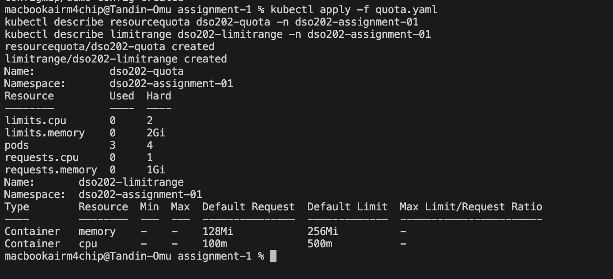

## Task 7 - Evidence

### a. Full CRUD Cycle

**Via curl**, through a port-forwarded backend
(`kubectl port-forward svc/backend-svc 8080:8080`):

**Create:**
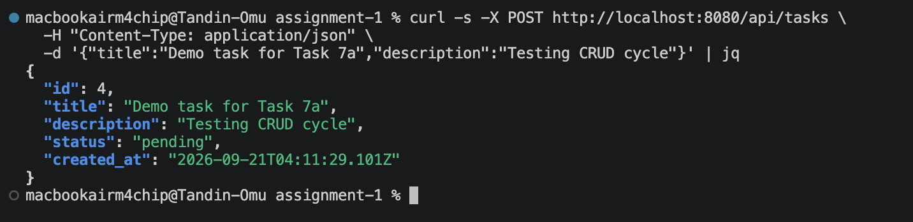

**List (confirming it was persisted):**
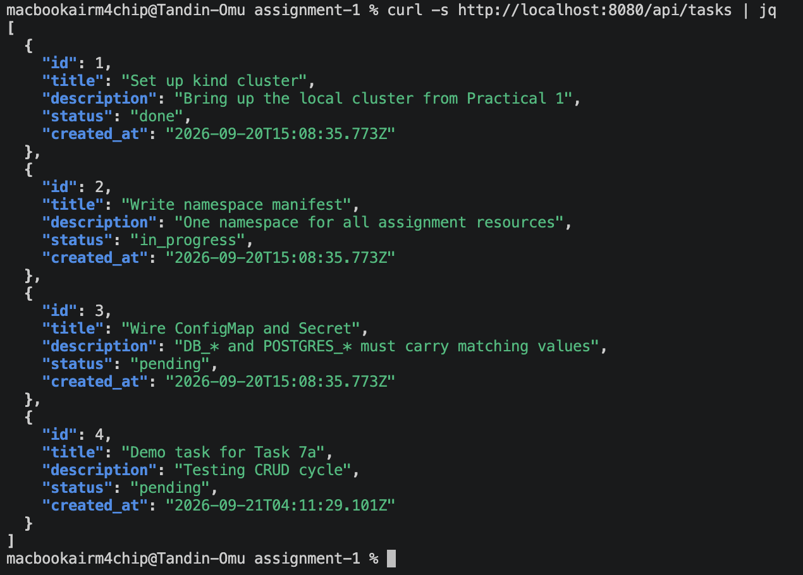

**Update:**
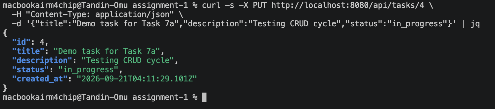

**Delete (and confirmation it's gone):**
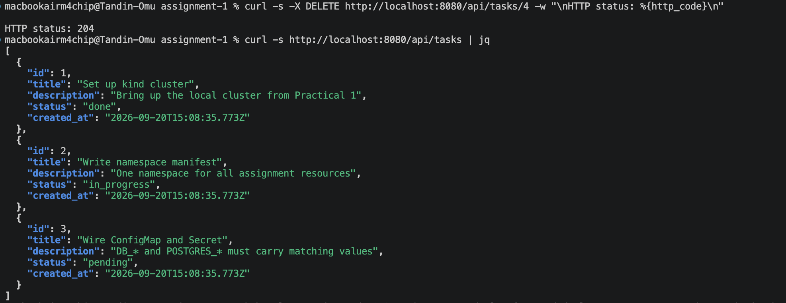

**Via the frontend UI** - for this demo only, `BACKEND_URL` was
temporarily pointed at `http://localhost:8080` (via a backend
port-forward) since a browser can't resolve the cluster-internal
`backend-svc` name; it was reverted back afterward.

**Create:**
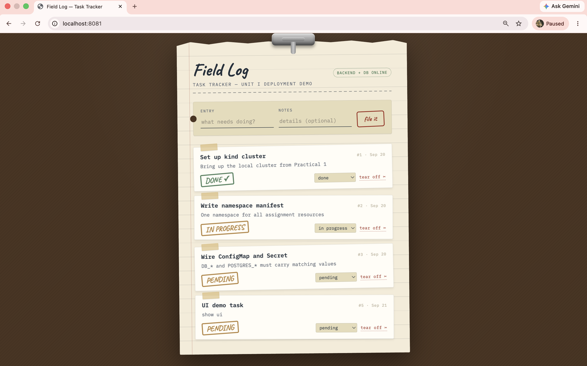

**Update:**
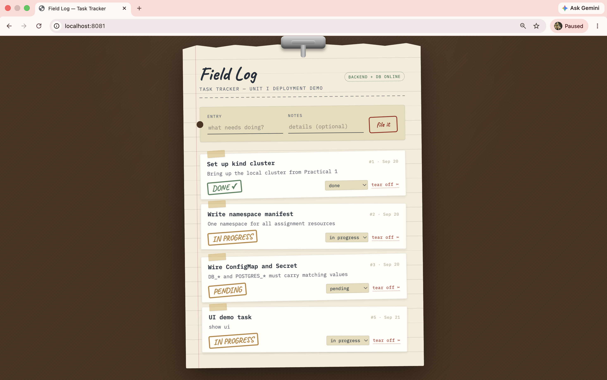

**Delete:**
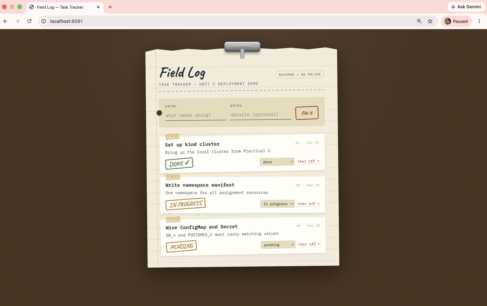

### b. Service DNS Resolution
From inside the frontend pod (`kubectl exec`), curled the backend
Service by name (`http://backend-svc:8080/api/status`) and got a
healthy response — confirms cluster DNS resolves Services correctly.

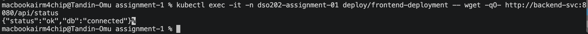

### c. Self-Healing & Data Persistence
The backend pod was deleted manually; the ReplicaSet recreated it
automatically; a task created beforehand was still retrievable
afterward.

**Task exists before deletion:**
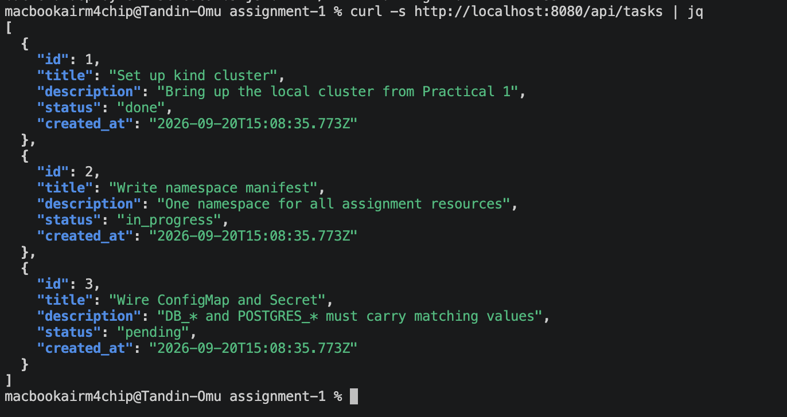

**Pod deleted and automatically recreated by the ReplicaSet:**
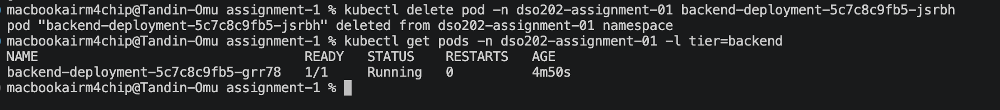

**Same task still retrievable after the new pod came up:**
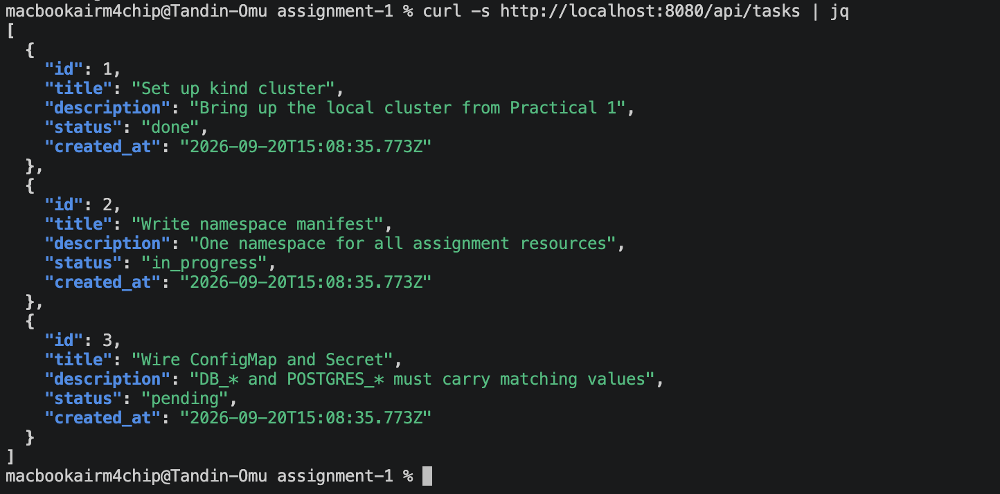

### d. Declarative vs. Imperative Comparison
A demo ConfigMap was created both ways.

**Declarative** (`kubectl apply -f demo-configmap.yaml`):
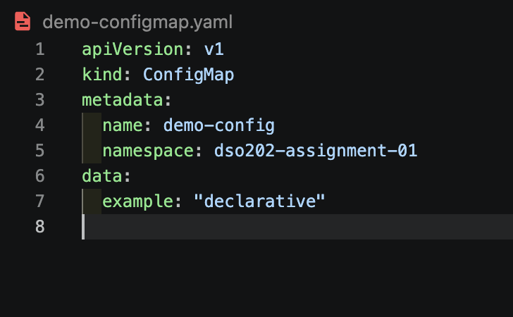

**Imperative** (`kubectl create configmap ... --from-literal=...`):
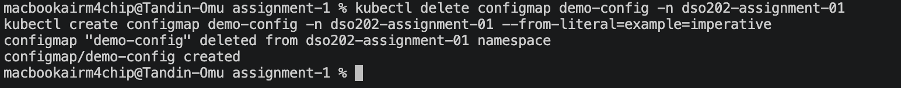

**Comparison:**

| | Declarative (`kubectl apply -f`) | Imperative (`kubectl create ...`) |
|---|---|---|
| **How it's done** | Desired state written to a YAML file, then applied | Object created directly via a single command |
| **Repeatability** | Idempotent - reapplying the same file is always safe | Not idempotent - running it again fails or errors if the object exists |
| **Version control** | File can be committed, reviewed, and diffed in Git | No file produced - nothing to commit or review |
| **Speed** | Slightly slower (write file, then apply) | Faster for quick, one-off objects |
| **Best for** | Real, reusable resources (used for everything else in this assignment) | Throwaway objects or quick debugging |

## Problems Faced

- **kind cluster lost on recreation:** the original 3-node cluster
  (`dso202-p2`, with a control-plane and two workers) had stopped
  responding after a restart. Recreating it without the original
  `kind-config.yaml` produced a single control-plane node only, and any
  `extraPortMappings` for browser-facing NodePort access were lost.
  `kubectl port-forward` was used as the fallback throughout, as the
  brief explicitly allows.
- **Slow image pulls inside the kind node:** the database image stalled
  at `ContainerCreating` for several minutes despite already being
  cached on the host. Resolved with `kind load docker-image`, which
  copies an image already pulled by Docker directly into the node's
  containerd, bypassing the slow pull.
- **Backend/frontend images lack `curl`:** both run on minimal images
  with no shell utilities beyond what's strictly needed. Verified
  connectivity instead using `node -e "fetch(...)"` (backend has Node)
  and `wget` (available in the nginx-alpine frontend image).
- **Browser couldn't resolve `backend-svc`:** the frontend's
  `BACKEND_URL` is a cluster-internal DNS name, meaningless to a browser
  running on the host. Worked around for UI screenshots only by
  temporarily port-forwarding the backend and pointing `BACKEND_URL` at
  `localhost`, then reverting it afterward — the real deployed value
  stays as `http://backend-svc:8080`, which is correct and required for
  the manifests to work when applied fresh.
- **Stuck/duplicate `kubectl port-forward` processes:** several commands
  failed with "address already in use" from earlier port-forwards left
  running in other terminals. Resolved by finding the process with
  `lsof -i :<port>` and killing the stale one, or forwarding to a
  different local port instead.

## Conclusion

All three tiers - database, backend, and frontend - were deployed
successfully into the `dso202-assignment-01` namespace, wired together
using ConfigMaps, Secrets, and Kubernetes Service DNS rather than any
hardcoded values. Persistent storage on the database tier was confirmed
to survive pod deletion, self-healing was confirmed via the
Deployment/ReplicaSet controllers, and namespace-level resource
governance was applied and verified with real usage numbers. The full
CRUD cycle was demonstrated both directly against the API and through
the actual frontend UI, and Kubernetes' internal DNS was confirmed
working from inside a running pod. This exercise reinforced how the
different Unit I building blocks, namespaces, ConfigMaps/Secrets,
Deployments, Services of different types, PersistentVolumeClaims, and
resource quotas - work together to run a realistic, multi-tier
application on a real (if local) cluster.

## Deploy

```bash
kubectl apply -f namespace.yaml
kubectl apply -f configmap.yaml
kubectl apply -f secret.yaml
kubectl apply -f quota.yaml
kubectl apply -f database/
kubectl apply -f backend/
kubectl apply -f frontend/
```